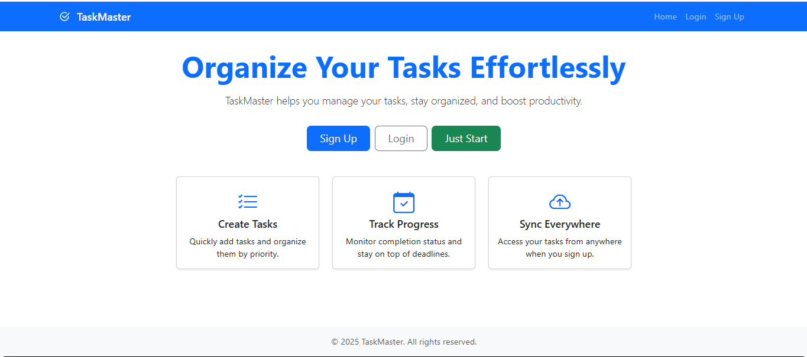
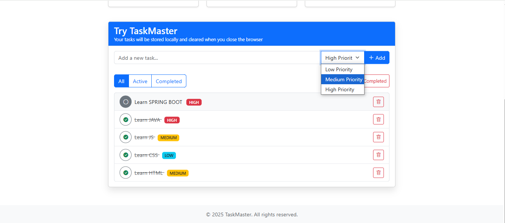

# Advanced Task Manager 
* A simple java web application using `Spring Boot` framework with the features 

+ Beautiful Bootstrap 5.3.6 UI
+ User authentication (signup/login)
+ Todo management features
+ Responsive design
+ Local storage for non-logged-in users
+ Database storage for logged-in users

### Used Languages:

* HTML
* CSS
* JAVASCRIPT
* JAVA

### Used Technologies & Frameworks:
+ Spring Boot
+ Thymeleaf
+ Bootstrap

## Home 

## Tasks

